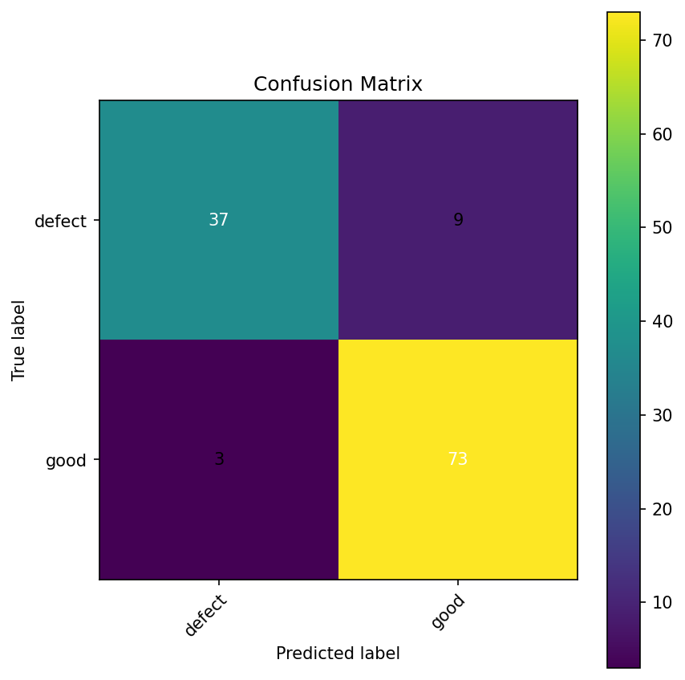

# Pharmaceutical Defect Classifier

Binary image classification project for detecting visual defects in pharmaceutical solid forms (pills and capsules) using PyTorch.

## Problem
The goal is to classify a pharmaceutical sample image as:
- `good`
- `defect`

This simulates a basic visual quality inspection pipeline.

## Dataset
The dataset was built from MVTec AD categories:
- `pill`
- `capsule`

A custom supervised split was created:
- `train`
- `val`
- `test`

To reduce leakage, visually related file groups were split together instead of random file-level splitting.

## Model
- Backbone: `ResNet18`
- Framework: `PyTorch`
- Input size: `224x224`
- Loss: `CrossEntropyLoss` with class weights
- Scheduler: `ReduceLROnPlateau`
- Early stopping enabled

## Test Results
Baseline threshold:
- Accuracy: `90.16%`
- Macro F1: `89.23%`
- Defect precision: `0.93`
- Defect recall: `0.80`
- Defect F1: `0.86`

Confusion matrix:



## Threshold Tuning
A custom threshold was applied to improve sensitivity to the `defect` class.
The tuned threshold and evaluation results are stored in:
- `artifacts/evaluation_threshold_tuning.json`

## Project Structure
```text
project/
├── data/
│   ├── source/
│   │   ├── good/
│   │   └── defect/
│   └── processed/
│       ├── train/
│       ├── val/
│       └── test/
├── models/
├── artifacts/
├── src/
│   ├── train.py
│   ├── evaluate.py
│   ├── predict.py
│   └── api.py
└── README.md
