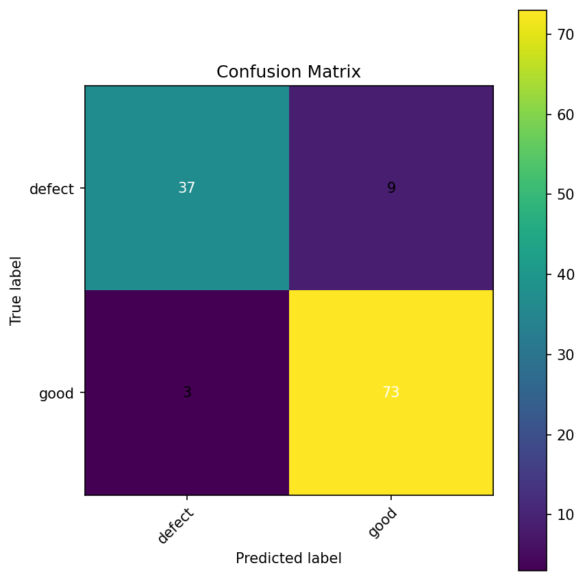

## Overview
This project simulates a basic visual quality inspection pipeline for pharmaceutical products.  
The model classifies an input image as:

- `good`
- `defect`

The current dataset combines two pharmaceutical object types:

- `pill`
- `capsule`

> [!NOTE]
> See an example in the .github folder

## Dataset
The dataset was built from MVTec AD categories:
- `pill`
- `capsule`

[source](https://www.mvtec.com/research-teaching/datasets/mvtec-ad)

A custom supervised split was created:
- `train`
- `val`
- `test`

To reduce data leakage, visually related image groups were split together instead of using naive random file-level splitting.

## Model
- Backbone: `ResNet18`
- Framework: `PyTorch`
- Input size: `224x224`
- Loss: `CrossEntropyLoss` with class weights
- Scheduler: `ReduceLROnPlateau`
- Early stopping enabled

## Test Results
Baseline threshold:
- Accuracy: `90.16%`
- Macro F1: `89.23%`
- Defect precision: `0.93`
- Defect recall: `0.80`
- Defect F1: `0.86`

Confusion matrix:



## Threshold Tuning
A custom threshold was introduced to improve sensitivity to the `defect` class.  
Threshold tuning results are saved to:

- `artifacts/evaluation_threshold_tuning.json`
- `artifacts/confusion_matrix_threshold_tuned.png`

## API
The project includes a FastAPI inference service.

Run locally:
```bash
uvicorn src.api:app --reload
```

Swagger UI:
`http://127.0.0.1:8000/docs`

## Docker
Build:
```bash
docker build -t pharma-defect-api .
```

Run:
```bash
docker run -p 8000:8000 pharma-defect-api
```

## Project Structure
```text
project/
├── data/
│   ├── source/
│   │   ├── good/
│   │   └── defect/
│   └── processed/
│       ├── train/
│       ├── val/
│       └── test/
├── models/
│   └── best_model.pth
├── artifacts/
├── src/
│   ├── train.py
│   ├── evaluate.py
│   ├── predict.py
│   ├── api.py
│   └── gradcam_demo.py
└── README.md
```

## Key Features
- Custom leakage-aware train/val/test split
- PyTorch training pipeline with class weighting
- Separate evaluation and threshold tuning
- FastAPI inference endpoint
- Dockerized deployment
- Grad-CAM visualization for model interpretability

## Limitations
- The dataset is relatively small.
- Some defects are visually subtle.
- The model still misses part of defective samples.
- This is a portfolio / educational prototype, not a production-grade pharmaceutical QA system.

## Future Work
- Improve defect recall
- Evaluate pill and capsule subsets separately
- Add ROC / PR analysis
- Improve inference-only Docker image size
- Add CI/CD for API validation
